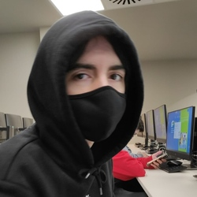

# Curriculum

- Teléfono: 90912314
- Gmail: jangomgal@natzaret.org

## Sobre Mi
Actualmente soy alumno de segundo año de Sistemas Microinformáticos y
Redes. Lo que más me interesa aprender es programar videojuegos, pero
estoy abierto a aprender de otros ámbitos y encontrar mi verdadera vocación

## Formacion
SISTEMAS MICROINFORMÁTICOS Y REDES
IFP Hospitalet | Sep 2020 - Presente
Tengo conocimientos básicos sobre redes locales, mantenimiento de
equipos, Linux (concretamente Ubuntu), entre otros que he ido
adquiriendo a lo largo de mi primer año.
ESO
Colegio Natzaret | Sep 2016 - Jun 2020

## Idiomas
- Castellano (Nativo)
- Catalán (Nativo)
- Inglés (A2)

## Paginas extra
- <a href="Actividad_5.2_JanGomez"> Guardian tales</a>
- <a href="Web_JanGómez"> Noticias</a>
- <a href="Actividad_5.3_JanGomez"> Guardian tales 2.0</a>
